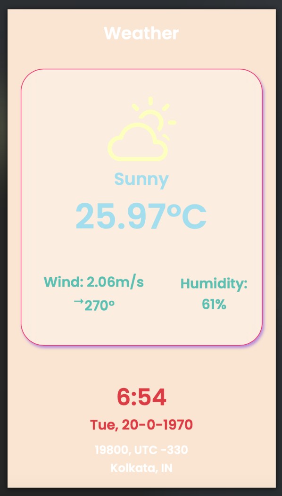

# weather-react-web-app

react functional web app with third party free open-weather-api.
   

### Step 1: Download Zip OR clone this repository.

 

### Step 2: Open terminal, go to this project directory.

 

### Step 3: Type `npm install` AND `npm start`.

 

> The web app should launch on `http://localhost:3000/`.
>    

